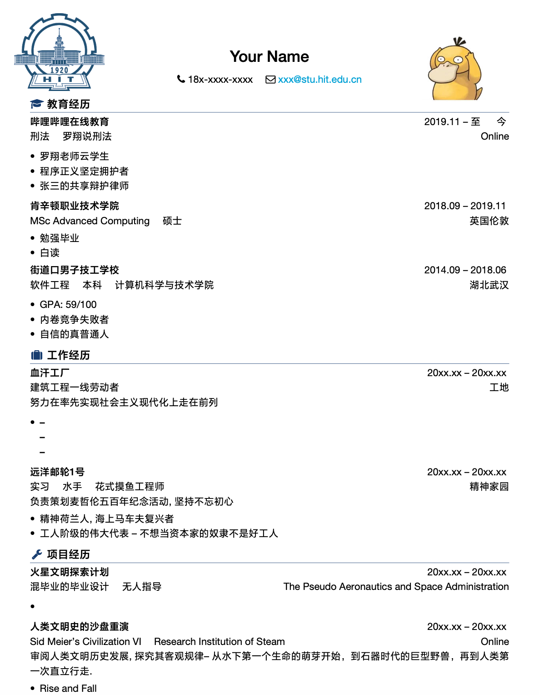
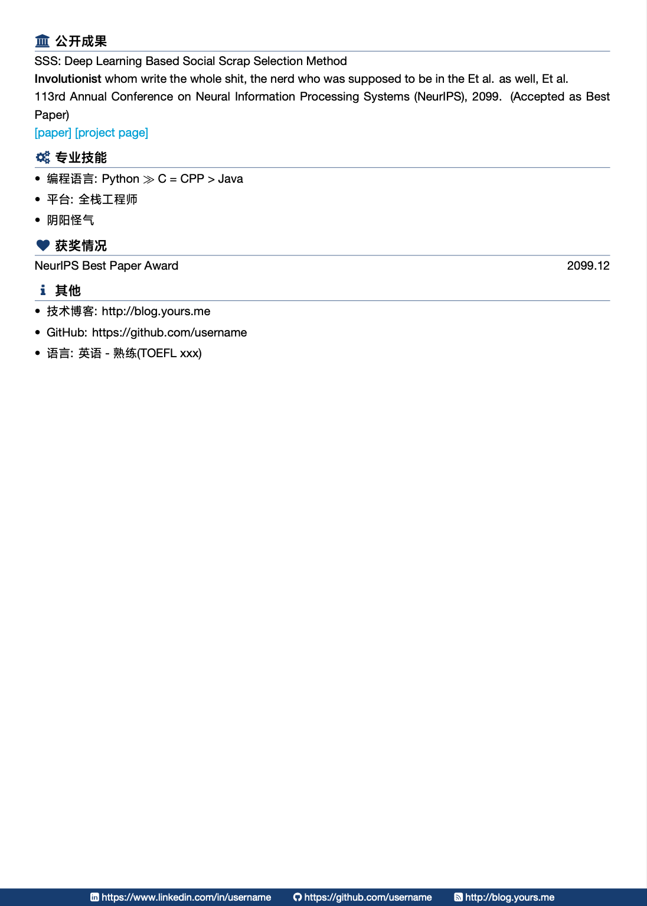

# resume-chinese-hit
HIT 中文 LaTeX 简历模板

本项目 fork 自 [zheyuye/resume-chinese](https://github.com/zheyuye/resume-chinese) 

#### 主要更改内容
- 把 fontawesome 放到 Font 文件夹下，解决 fontawesome 字体无法查找为题。
- 将图片放入到 `img` 文件夹下，结构简单
- 优化布局，更改 logo 为 HIT 
- 支持本地运行

主要参考：

- [billryan/resume](https://github.com/billryan/resume)
- [WonderCV 学生求职模板](https://www.wondercv.com/zh-CN/resume_templates)
- [Htallone/myCV](https://github.com/Htallone/myCV)
- [hijiangtao/resume](https://github.com/hijiangtao/resume)
- [zheyuye/resume-chinese](https://github.com/zheyuye/resume-chinese)

LaTex语法内容以及框架基本上参照[Htallone/myCV](https://github.com/Htallone/myCV), 宏主要参照[hijiangtao/resume](https://github.com/hijiangtao/resume), 集各家之所长后做了些小修改, 方便直接从overleaf编译. 

### 使用步骤

#### overleaf

1. Download ZIP
2. Overleaf -> New Project -> Upload Project
3. Do your own editing
4. **选择complier为`XeLaTeX`** (注意)

#### 本地运行
需要本地安装好 LaTeX
```bash
# 编译简历
make 

# 清除中间件
make clean
```

### 文件结构

`resume-photo.tex`: 照片版简历头部

`resume.tex`: 文字版简历头部

`body.tex`: 简历主要内容

`footer.tex`: 页脚内容

`img/self.jpg`: 你的肖像（选一个好看的 ^-^）

###  宏(newcommand)

- `\name`: 姓名
- `\contactInfo`{邮箱}{手机号}{个人主页}`: 个人信息三元组
- `\basicContactInfo`{邮箱}{手机号}: 个人信息两元组, 没有个人主页的可以用这个
- `\logosection{fontawesome command}{小节}`: 用于分节, 如教育背景, 实习项目经历等
- `\dateRange{起始日期}{终止日期}`: 时间区间, 其中使用了特殊对齐策略, 便于在`终止日期`处填写**至今**
- `\datedline{内容}{日期}`: 第二项自动右对齐, 广泛使用于简历中, 嵌套`\dateRange`使用效果更佳
- `\biInfo{}{}`: 两元组信息填充, 以`\quad`分割
- `tripleInfo{}{}{}`: 三元组信息填充, 以`\quad`分割
- `\itemize`: 清单列表，简历中应用最广
- `\enumerate`: 枚举列表，数字标号


### 效果示例



